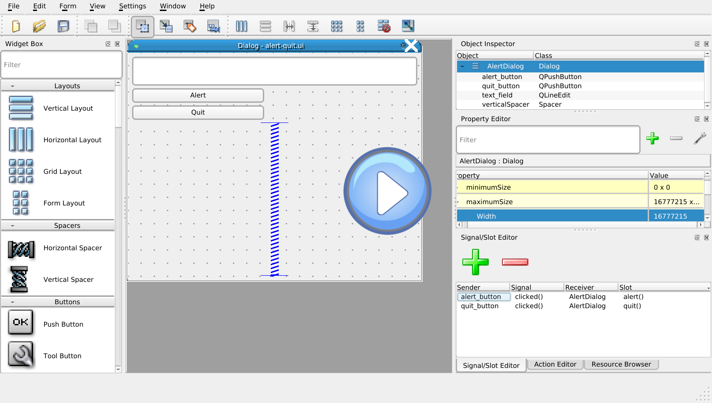

# Qt for Python tutorial

This tutorials shows how you can use [Qt for Python](https://www.qt.io/qt-for-python) – still often (mostly) referred as PySide2 – to build a desktop app with Python 3.

It covers the whole workflow:

- setting up Qt for Python,
- creating the Qt application and simple dialogs,
- loading a Qt Designer `.ui` file with a complex dialog,
- creating an executable package you can distribute for Windows, Mac and Linux.

This tutorial is based on [PyQt5 tutorial: Learn how you can create a Python GUI in 2018](https://build-system.fman.io/pyqt5-tutorial) by [Michael Hermann](http://herrmann.io/).

## Qt for Python

[Qt for Python](https://www.qt.io/qt-for-python) is a library that lets you use the Qt GUI framework to create desktop applications from Python.

While [Qt for Python](https://www.qt.io/qt-for-python) is the official set of Python bindings for Qt, its latest release is still labelled as _technical preview_. Historically, a separate project has existed for many years and is to be considered more mature [PyQt5](https://riverbankcomputing.com/software/pyqt/).  
The two libraries have an almost identicall API – both mimicking closely the Qt original API – the main difference being the license: [Qt for Python]() is LGPL (and has the same license as Qt)  and PyQt5 is GPL.

This tutorial presents Qt for Python, the [original tutorial by Michael Hermann](https://build-system.fman.io/pyqt5-tutorial) presents PyQt5.

## Install Qt for Python

The best way to create Python application that use packages and modules that don't come as part of the standard library is via a [virtual environment](https://docs.python.org/3/tutorial/venv.html).

Virtual environments make it easy to enclose in a directory all dependencies of your project, without affecting the rest of the system.

To create a virtual environment as a sub directory of your project directory, execute the following command

```
python3 -m venv venv
```

This creates a `venv` directory where you will find all the libraries you sintall with pip.

Whenever you work on the code in this tutorial, you need to activate the virtual environment.  

On Linux and Mac, activate the virtual environment with:

```sh
source venv/bin/activate
```  

On Windows with:

```sh
call venv/scripts/activate.bat
```  

When the virtual environment is active you will see the `venv` prefix in your shell:


Of course, you can pick any name you like for the virtual environment, `venv` is just a common used name.

When the virtual environment is active, you can install Qt for Python locally to your project:

```sh
pip install PySide2
```  

As mentioned in the introduction, while the official name is "Qt for Python", currently you still mostly have to use the old name: PySide2.  
This applies for both the pip package, the name of the library you import and the search keywords, when you're looking for help.

If you're using an IDE like PyCharm, by default it will create a virtual environment for each project and – in the project's configuration – gives you [an interface for adding the PySide2 module](https://www.jetbrains.com/help/pycharm/installing-uninstalling-and-upgrading-packages.html).

## Create a desktop application

Time to write your first desktop application.

In the  directory created by `venv` write the following Python file:

<!-- <src/hello-world.py> -->
```py
from PySide2.QtWidgets import QApplication, QLabel

app = QApplication([])
label = QLabel('Hello World')
label.show()
app.exec_()
```

With the virtual environment still active, you can run the program and you will see an "Hello World" window:


How does it work? Let's dissect the 5 lines above, one line at a time.

First we tell Python to load the QApplication and QLabel modules from the Qt for Python library (yes, `PySide2`...).

```py
from PySide2.QtWidgets import QApplication, QLabel
```

Next, we create the `app`, a [QApplication](https://doc.qt.io/qtforpython/PySide2/QtWidgets/QApplication.html):

```py
app = QApplication([])
```

Every Qt program must have exactly one instance of `QApplication`.

`QApplication` expects the command line arguments to be passed as argument: since we don't have any, we pass an empty array (`[]`).

A label is a text to be shown in the window:

```py
label = QLabel('Hello World')
```

You can guess now, why there can be only `QApplication`: you don't need to _manually_ link `QLabel` to your `app`, this is done by Qt.

Since the label _acts_ acts as a window, we have to tell Qt to show it:

```py
label.show()
```

Finally, we hand the control over to Qt and ask it to "run the application until the users quits it":

```py
app.exec_()
```

Congratulations, you've built your first desktop app with Python and Qt.

## The Qt Widgets

Everything you see in a Qt app is a [widget](https://doc-snapshots.qt.io/qtforpython/PySide2/QtWidgets/index.html): windows, dialogs, labels, buttons, progress bars, etc.

Widgets are often nested: for example, a dialog can contain a button, which in turn contains a label.

This screenshot shows the most common Qt widgets:


Top-to-bottom, left-to-right, they are:

- [QLabel](https://doc-snapshots.qt.io/qtforpython/PySide2/QtWidgets/QLabel.html)
- [QComboBox](https://doc-snapshots.qt.io/qtforpython/PySide2/QtWidgets/QComboBox.html)
- [QCheckBox](https://doc-snapshots.qt.io/qtforpython/PySide2/QtWidgets/QCheckBox.html)
- [QGroupBox](https://doc-snapshots.qt.io/qtforpython/PySide2/QtWidgets/QGroupBox.html)
- [QRadioButton](https://doc-snapshots.qt.io/qtforpython/PySide2/QtWidgets/QRadioButton.html)
- [QButton](https://doc-snapshots.qt.io/qtforpython/PySide2/QtWidgets/QButton.html)
- [QTabWidget](https://doc-snapshots.qt.io/qtforpython/PySide2/QtWidgets/QTabWidget.html)
- [QTableWidget](https://doc-snapshots.qt.io/qtforpython/PySide2/QtWidgets/QTableWidget.html)
- [QLineEdit](https://doc-snapshots.qt.io/qtforpython/PySide2/QtWidgets/QLineEdit.html)
- [QSpineBox](https://doc-snapshots.qt.io/qtforpython/PySide2/QtWidgets/QSpineBox.html)
- [QDateTimeEdit](https://doc-snapshots.qt.io/qtforpython/PySide2/QtWidgets/QDateTimeEdit.html)
- [QSlider](https://doc-snapshots.qt.io/qtforpython/PySide2/QtWidgets/QSlider.html)
- [QDial](https://doc-snapshots.qt.io/qtforpython/PySide2/QtWidgets/QDial.html)
- [QProgressBar](https://doc-snapshots.qt.io/qtforpython/PySide2/QtWidgets/QProgressBar.html)

## The layouts

There is one thing that you cannot directly see in the "widgets showroom" above, but still can guess: the layouts.  
The whole window is defined as a vertical layout, where each row has an horizontal layout.

For complex layouts like the one above, Qt provides the [Qt Designer](http://doc.qt.io/qt-5/qtdesigner-manual.html) application, that produces `.ui` files that can be loaded in Qt for Python.

We will have a look at the `.ui` files later. First we have a look at how the layout can be created and used directly in the Python code.

We create a simple dialog with two buttons vertically stacked:

<!-- <src/layout.py> -->
```py
from PySide2.QtWidgets import QApplication
from PySide2.QtWidgets import QDialog, QVBoxLayout, QPushButton

app = QApplication([])
dialog = QDialog()

layout = QVBoxLayout()
layout.addWidget(QPushButton('Top'))
layout.addWidget(QPushButton('Bottom'))
dialog.setLayout(layout)
dialog.show()
app.exec_()
```


As in previous example, we first create an `app`, then a dialog that will contain two buttons.

Since we want the buttons, to be automatically placed on top of each other, we create a layout of type [`QVBoxLayout`](https://doc.qt.io/qtforpython/PySide2/QtWidgets/QVBoxLayout.html) and add the two buttons into it.

Using a [QHBoxlayout](https://doc.qt.io/qtforpython/PySide2/QtWidgets/QHBoxLayout.html) would automatically put the buttons next to each other. You can try it!

Finally, we tell the dialog to use the layout we have defined, show it and run the application.

## Signals and slots

Qt uses _signals_ to let the application react to events such as the user clicking a button. In the following example,

- When clicking on the "Alert" button, an message pops up with the content of the input field in the dialog.
- The application quits as soon the "Quit" button is clicked.

<!-- src/signals-slots.py -->
```py
from PySide2.QtWidgets import QApplication
from PySide2.QtWidgets import QDialog, QMessageBox, QVBoxLayout
from PySide2.QtWidgets import QPushButton, QLineEdit

app = QApplication([])
dialog = QDialog()

def on_alert_clicked():
    global text_field
    alert = QMessageBox()
    alert.setText(text_field.text())
    alert.exec_()

layout = QVBoxLayout()
text_field = QLineEdit()
alert_button = QPushButton('Alert')
quit_button = QPushButton('Quit')
layout.addWidget(text_field)
layout.addWidget(alert_button)
layout.addWidget(quit_button)
dialog.setLayout(layout)

alert_button.clicked.connect(on_alert_clicked)
quit_button.clicked.connect(quit)

dialog.show()
app.exec_()
```

As in the previous example, we are laying out the widgets in a vertical layout.

This time, we are first creating the buttons and in a second step we add them to the layout. By doing it in two steps, we have an object that we can further use in our code to set the action to be performed by the buttons.

For the "Alert" button we create a `on_alert_clicked` function that reads the value of the `text_field` input field and we `connect` it to the `clicked` signal of the alert_button.

## Encapsulating the dialog in a class

Then we simply connect the click signal of the "Quit" button with the `quit` function defined by `QApplication`.

As we have seen in the "signals" example, as soon as the the widgets _interact_, we need them to _see_ each other. In the example above, we have done it by marking `text_field` as global.

A better solution is to encapsulate the dialog in a class:

```py
from PySide2.QtWidgets import QApplication
from PySide2.QtWidgets import QDialog, QMessageBox, QVBoxLayout
from PySide2.QtWidgets import QPushButton, QLineEdit

class Dialog(QDialog):
    def __init__(self, parent = None):
        super(Dialog, self).__init__(parent)

        self.text_field = QLineEdit()
        self.alert_button = QPushButton('Alert')
        self.quit_button = QPushButton('Quit')

        layout = QVBoxLayout()
        layout.addWidget(self.text_field)
        layout.addWidget(self.alert_button)
        layout.addWidget(self.quit_button)
        self.setLayout(layout)

        self.alert_button.clicked.connect(self.alert)
        self.quit_button.clicked.connect(quit)

    def alert(self):
        alert = QMessageBox()
        alert.setText(self.text_field.text())
        alert.exec_()

if __name__ == '__main__':
    app = QApplication([])
    dialog = Dialog()
    dialog.show()
    app.exec_()
```

Here, we create our own `Dialog` class that extends the `QDialog` provided by Qt: the code is very similar to the previous example, but now the buttons and the input fields belong to the same context and can access each other.

You will have noticed that we only create the application if `__name__ = '__main__'`. Trough this cryptic condition we make sure that the application is only started when the program is directly run and not imported as a library.

## Using Qt Designer

If you have used other GUI frameworks in the past, you could problaby appreciate the compactness and readability of the code we have present until now. But – as you can probably guess – creating a dialog like the one we have seen in the [Qt Widgets](#the-qt-widgets) chapter will lead to a long list of _trivial_ instantiation of widgets.

Here is where [Qt Designer](http://doc.qt.io/qt-5/qtdesigner-manual.html) comes to our rescue.

Qt Designer is part of [Qt Creator](http://doc.qt.io/qtcreator/), the IDE for the C++ Qt. The IDE itself is not really geared towards writing Python code, but you can use Qt Designer as a standalone for creating layouts for the Python applications.

In a first exemple, we create the same dialog as above:

- Open Qt Designer as a standalone application and create a file with the template "Dialog without Buttons".
- Pull two "Push Buttons" and a "Line edit" into the dialog.
- Right click on the dialog's background and set its layout to the vertical one. 
- Rename the widgets to `text_field`, `alert_button`, `quit_button` and set buttons labels to "Alert" and "Quit".
- Reduce the maximum size of the buttons to 100.
- Add a vertical spacer below the three widgets.
- Rename the dialog to "AlertDialog" (the name in the `.ui` file cannot be the same as the name of the class you create in your code).
- Add the signals by activating the "Signal" mode, pulling the new signals from the buttons into the background and defining the two new signals `alert()` and `quit()`.
- Save the file as `alert-quit.ui`.

[](https://raw.githubusercontent.com/aoloe/python-tutorial-qt/master/images/alert-quit.webm)

There is one step, that Qt Designer does not implement. You have to open the `alert-quit.ui` file with a text editor and modify its fourth line from

```xml
 <widget class="QDialog" name="AlertDialog">
```

to 

```xml
 <widget class="Dialog" name="AlertDialog">
```

At first sight, these steps might seem a bit cumbersome. Luckily, integrating the `.ui` file in Python is pretty easy:

```py
from PySide2.QtWidgets import QApplication
from PySide2.QtWidgets import QDialog, QMessageBox
from PySide2.QtCore import QFile, Slot
from PySide2.QtUiTools import QUiLoader

class Dialog(QDialog):
    def __init__(self, parent = None):
        super(Dialog, self).__init__(parent)

    @Slot()
    def alert(self):
        alert = QMessageBox()
        alert.setText(self.text_field.text())
        alert.exec_()
        
    @Slot()
    def quit(self):
        quit()

if __name__ == '__main__':
    app = QApplication([])

    loader = QUiLoader()
    loader.registerCustomWidget(Dialog)

    base_dir = os.path.dirname(os.path.realpath(__file__))
    dialog = loader.load(os.path.join(base_dir, 'alert-quit.ui'))
    dialog.show()

    app.exec_()
```

TODO:

- show, how to embed the widgets examples and let it switch style.
- http://doc.qt.io/qt-5/qtwidgets-widgets-styles-example.html
- you can also load _partial_ widgets (to be added to your class):

  ```py
  from PySide2.QtWidgets import QApplication
  from PySide2.QtUiTools import QUiLoader
  app = QApplication([])
  dialog_ui = QUiLoader().load("list-of-buttons.ui")
  dialog_ui.show()
  app.exec_()
  ```

## Windows and Mac Styles

When the program runs on a Mac Os or Windows system, you might want it to use the a style that is closer to the native one, rather than use the typical Qt style.

You can use [`setStyle`](https://doc.qt.io/qtforpython/PySide2/QtWidgets/QApplication.html?#PySide2.QtWidgets.PySide2.QtWidgets.QApplication.setStyle) to modify the look and feel of the widgets demo dialog:

```py
from PySide2.QtWidgets import QApplication
app = QApplication([])
app.setStyle('Fusion')
# ...
```

The available styles are: "windows" (Windows only), "windowsvista" (Windows only), "fusion", and "macintosh" (OS X only).

## Style sheets

You can change the appearance of the widgets via _style sheets_. This is Qt's analogue of CSS.

- List of all properties that can be set: <http://doc.qt.io/qt-5/stylesheet-reference.html#list-of-properties>
- [Seventeen CSS 2.1 color names](http://www.w3.org/TR/CSS21/syndata.html#color-units) are available.

TODO: to be redacted


## Further reading

- [Projets and tutorials for building desktop GUI applications in Python](https://www.pymadethis.com/tag/gui/)
- [Create Simple GUI Applications: Quick, awesome applications in Python with Qt](https://github.com/mfitzp/create-simple-gui-applications/blob/master/Book.adoc) (you can [buy it here](https://www.pymadethis.com/create-simple-gui-applications/).
- More on signals and slots: https://wiki.qt.io/Qt_for_Python_Signals_and_Slots
## Notes

- Modify the bash prompt: `$PS1="${debian_chroot:+($debian_chroot)}\[\033[01;32m\]\u\[\033[00m\]:\[\033[01;34m\]\w\[\033[00m\]\$"`
- Play button: https://openclipart.org/detail/164047/blue-play-button-pressed-down
